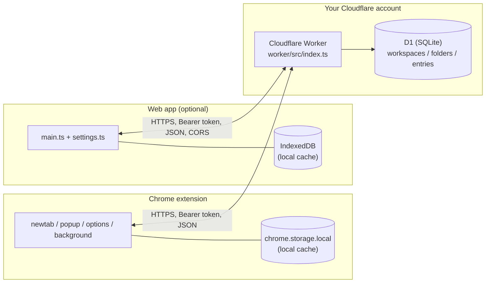

# Architecture

How Shelve is built, for anyone reading the code or thinking about contributing.
For "how do I deploy this," see [README.md](README.md).

## System overview



Each deployment is single-user: one person's own devices, talking to one Worker + one D1 database, authenticated with one shared secret.
There's no accounts system, no multi-tenancy, and no Cloudflare-hosted shared service — every user deploys their own copy.

## Data model

Hierarchy: **workspace → folder → entry**.
Modeled loosely after Toby (its "collections" map to our folders, and its "spaces" to our workspaces), with one addition Toby doesn't have: note-only entries.

```sql
CREATE TABLE workspaces (
  id TEXT PRIMARY KEY,
  name TEXT NOT NULL,
  position INTEGER NOT NULL,
  created_at INTEGER NOT NULL,
  updated_at INTEGER NOT NULL,
  deleted_at INTEGER          -- soft-delete marker, see Sync model below
);

CREATE TABLE folders (
  id TEXT PRIMARY KEY,
  workspace_id TEXT NOT NULL REFERENCES workspaces(id),
  name TEXT NOT NULL,
  position INTEGER NOT NULL,
  created_at INTEGER NOT NULL,
  updated_at INTEGER NOT NULL,
  deleted_at INTEGER
);

CREATE TABLE entries (
  id TEXT PRIMARY KEY,
  folder_id TEXT NOT NULL REFERENCES folders(id),
  url TEXT,                  -- NULL for note-only entries
  title TEXT,
  favicon_url TEXT,          -- pointer only, never stored image data
  note TEXT,
  position INTEGER NOT NULL,
  created_at INTEGER NOT NULL,
  updated_at INTEGER NOT NULL,
  deleted_at INTEGER,
  CHECK (url IS NOT NULL OR note IS NOT NULL)
);
```

`position` at every level supports stable drag-and-drop ordering.
The `default` workspace id is fixed (not a random UUID) — every fresh device auto-creates it before ever syncing, and a shared well-known id lets separate devices converge on that one record instead of ending up with two "Home" workspaces after their first sync.

The "open tabs" panel (browse currently-open tabs, drag into a folder) has no schema — it's rendered live from `chrome.tabs.query()` in the extension, not stored anywhere.

**Not yet in the schema:** tags, screenshots, note-editing UI (the `note` column and note-only entries are fully supported end to end, but the UI to create/edit them is currently disabled pending a better interaction design).

## Sync model

### API shape

Reads and writes are asymmetric on purpose:

- `GET /state` returns the whole `{ workspaces, folders, entries }` tree (including soft-deleted rows) — a simple full pull, used for initial load on a new device and for reconciliation.
- Writes are per-resource: `POST`/`PATCH`/`DELETE` on `/workspaces/:id`, `/folders/:id`, `/entries/:id`.
  The extension pushes each local mutation individually and fire-and-forget (the UI never blocks on network) rather than diffing and re-sending whole state trees.

### Conflict resolution

Last-write-wins by `updated_at`, no CRDT merge logic — appropriate for single-user-multi-device (the only real conflict source is the same person editing on two devices while offline, not concurrent strangers).
The Worker's write path is **upsert-by-recency**: a `POST`/`PATCH` only applies if the incoming `updated_at` is newer than what's already stored; a stale/late write from another device just silently loses the race rather than overwriting newer data.

### Deletes are soft, and that's load-bearing

`DELETE /:kind/:id` is a single targeted `UPDATE ... SET deleted_at = ?, updated_at = ? WHERE id = ?` — never a bulk operation, never a full-table replace.
This is the result of two earlier designs that didn't work:

- A **full-snapshot write** (`PUT /state` replacing the entire tree) has a real wipe-the-database failure mode: any client bug that pushes an incomplete or empty payload permanently destroys remote data with no undo.
- **Hard `DELETE` plus a separate tombstone table** fixed the write-safety problem but broke _delete propagation_: the client's merge logic deliberately never removes a local record just because it's absent from a `GET /state` response (same wipe-avoidance principle), so a device pulling after another device's hard-delete would never learn the record was gone — it would keep it forever.

Soft-delete via a `deleted_at` column solves both: still a single targeted write (no wipe risk), and `deleted_at` flows through the exact same "newer `updated_at` wins" merge logic as any other field — a soft-deleted record simply out-recencies a stale non-deleted copy on the next pull, with zero special-cased deletion code.
It also means content is retained rather than erased, which is what makes a future trash view relatively cheap to add.

**Practical implication:** normal use of Shelve can never destroy your data through a sync bug — the worst case is a stale write losing a race, which self-heals on the next sync.
Cloudflare D1's own point-in-time recovery ("Time Travel," see the README FAQ) is the backstop one layer below this, for infrastructure-level issues rather than application logic.

### Schema versioning

The extension, the web app, and the Worker are all updated independently by hand (see README.md's "Upgrading"), so a client can never assume the Worker it's talking to has caught up to the schema it expects.
`GET /health` reports `{ ok, version, schemaVersion }` — `schemaVersion` is a plain integer, bumped in `shared/types.ts`'s `SCHEMA_VERSION` constant whenever a file is added to `worker/migrations/`.
`core/lib/sync.ts` checks this once per page load (memoized, so it doesn't cost an extra round-trip per request) and refuses to send any further request — logging a warning instead — if the Worker's `schemaVersion` is behind what the client expects.
A Worker that's merely unreachable (network error, misconfigured URL) is treated differently: sync fails open in that case, consistent with the rest of sync's best-effort, never-blocking error handling.
The extension's options page and the web app's settings screen both surface this directly (the connected Worker's version, and a clear warning if it's out of date) rather than leaving it to a console warning only.

### Client-side merge

`core/lib/sync.ts`'s `mergeArray()` implements the pull side: for each id present in either local or remote, keep whichever has the newer `updated_at`; records present only locally are always kept (never deleted by a pull).
`pushAll()` re-pushes every local record on each app load — idempotent (upsert-by-recency makes re-sending unchanged data a no-op), and it exists specifically to catch anything created locally that never successfully synced (most notably the default workspace on first run, which nothing else explicitly pushes).

## Auth

A single shared secret.
The Worker checks `Authorization: Bearer <token>` against an `API_TOKEN` secret (`wrangler secret put`, stored encrypted by Cloudflare, never written to any file).
No accounts, no OAuth — every request is either "has the token" or 401.

The extension stores the Worker URL and token in `chrome.storage.local` (device-only), deliberately not `chrome.storage.sync` — keeps the token off Google's sync infrastructure, consistent with the project's self-hosted, no-third-party-trust premise. The web app stores the same config in its own browser-local IndexedDB (see "Web app architecture" below) — same trust model, same trade-off.
Trade-off: you enter it once per device rather than it propagating automatically.

Cross-origin requests (the web app, on a different origin than the Worker) need CORS, which the extension never did — see `worker/src/index.ts`'s `withCors()`. `Access-Control-Allow-Origin: *` rather than restricting to a specific origin: `isAuthorized()` is already a flat bearer-token check with zero origin-awareness, so the token — not same-origin policy — is the real security boundary either way.

## Extension architecture

Manifest V3, four surfaces:

- **`newtab/`** — the main folder-browser UI.
  Two-panel layout (folders in the main area, a live "open tabs" panel on the right, both collapsible).
  Optionally shown on every new tab (see below), always reachable via the toolbar popup's "Open full UI."
- **`popup/`** — the toolbar icon's popup: save the current tab, save every tab in the window (both via a folder picker), or open the full UI.
- **`options/`** — Worker URL + token configuration (with an immediate connectivity check on save), the new-tab toggle, and a "Data" section for Toby import/export and native Shelve backup export/import.
- **`background/`** — a service worker that implements the _optional_ new-tab takeover.
  There is deliberately no static `chrome_url_overrides.newtab` in the manifest: Chrome has no supported way to dynamically toggle a manifest-level override, and once declared there's no way back to Chrome's real default new-tab page short of the user disabling the extension entirely.
  Instead, the background worker listens for `chrome.tabs.onCreated` and redirects to `newtab/index.html` only when a device-local preference (default: on) says to — off means Chrome's real default page shows, untouched.

Most shared code lives in the `core/` workspace, not `extension/` — see "The `core` package" below. `extension/src/lib/` itself now only holds the two thin adapters that plug `core`'s platform-agnostic code into real `chrome.*` APIs (`chromeStore.ts`, `chromeTabActions.ts`).

Native HTML5 drag-and-drop throughout (folders reordering within a workspace, entries moving between folders, tabs dragging in from the open tabs panel) — no drag-and-drop library dependency.

## The `core` package

`core/` holds everything that doesn't actually need `chrome.*` — local storage/CRUD (`lib/storage.ts`), sync (`lib/sync.ts`), the in-window modal that replaces native `window.prompt()`/`confirm()` (`lib/modal.ts`), Toby import/export (`lib/tobyImport.ts`), manually-added-link metadata fetching (`lib/linkMetadata.ts`), device-local UI/behavior preferences (`lib/uiState.ts` — folder collapse state, the new-tab toggle, the light/dark/auto theme; deliberately _not_ part of the synced data model, since these are per-device presentation choices, not data), and almost all of the folder-browser's DOM-builder code (`ui/folders.ts`, `ui/toolbar.ts`, `ui/rail.ts`, `ui/trash.ts`, `ui/folderPicker.ts`, `ui/context.ts`).

This split exists because Shelve has a lightweight web app alongside the extension (see "Web app architecture" below), and auditing the code showed the actual `chrome.*` coupling was narrow — a handful of `chrome.storage.local` calls and `chrome.tabs.create`/`remove` calls — while everything else was already platform-agnostic. Two small seams cover that handful:

- **`Store`** (`core/lib/store.ts`) — a `get`/`set` interface that `storage.ts`/`uiState.ts`/`config.ts` read/write through instead of calling `chrome.storage.local` directly. A module-level singleton set once per page load (`setStore()`), mirroring how `applyTheme()` already runs once per load — not threaded as a parameter, since only those 6 functions ever touch persistence (everything else, e.g. `createEntry`/`deleteEntry`, mutates an already-loaded `State` object in memory). `extension/src/lib/chromeStore.ts` implements it via `chrome.storage.local`; `web/src/webStore.ts` implements it via IndexedDB (see below).
- **`TabActions`** (`core/ui/context.ts`, part of `AppContext`) — `open(url, opts)`/`close(tabIds)`, covering the handful of `chrome.tabs.create`/`chrome.tabs.remove` calls inside the moved UI code. `extension/src/lib/chromeTabActions.ts` implements it via `chrome.tabs`; `web/src/webTabActions.ts` implements `open` via `window.open` and no-ops `close` — a web page has no way to close an arbitrary tab by id, so `closeTabOnSave` is silently inert on web (the settings screen never exposes that toggle there). `AppContext.openSettings` is a similar one-off seam: `chrome.runtime.openOptionsPage()` on the extension, a local view-state toggle on web (no shared-`AppContext` change needed — see below).

`core/tsconfig.json` deliberately has no `"types": ["chrome"]` — any accidental direct `chrome.*` reference left in a moved file fails `tsc --noEmit` immediately, a compiler-enforced boundary rather than a code-review convention.

What's still extension-only and stays in `extension/`: `newtab/tabsPanel.ts` (the live open-tabs panel — `chrome.tabs`/`chrome.windows` top to bottom, no web equivalent is possible), all of `popup/` (one-click save-current-tab needs `chrome.tabs`), and `background/` (the new-tab takeover is `chrome.tabs.onCreated`-based).

## Web app architecture

`web/` is a single-page Vite app (unlike the extension's multi-entry newtab/popup/options build) sharing `core/`'s storage/sync/UI code, with three web-specific files:

- **`web/src/webStore.ts`** — the `Store` implementation, backed by IndexedDB rather than `localStorage`: `Store`'s interface is already `Promise`-based (designed around `chrome.storage.local`'s async shape), so this is a drop-in backend swap, and it sidesteps `localStorage`'s small (~5-10MB) quota and synchronous `QuotaExceededError` throw in favor of IndexedDB's much larger best-effort browser quota. It also handles a gap IndexedDB doesn't solve on its own: unlike `localStorage`, IndexedDB has no native cross-tab change event, so two browser tabs of the web app open at once would otherwise silently diverge with zero feedback. `webStore.set()` posts a message on a `BroadcastChannel` after every write; `web/src/main.ts` listens and reloads+re-renders state when another tab changes it — not real conflict merging (still last-write-wins if two tabs save in the same instant), but it closes the _silent, indefinite_ divergence case.
- **`web/src/webTabActions.ts`** — the `TabActions` implementation described above.
- **`web/src/settings.ts`** — the web app's settings/connect screen (Worker URL/token, theme, backup and Toby import/export), modeled on `extension/src/options/main.ts` but reached via `AppContext.openSettings` toggling a local view-state variable in `main.ts` rather than a separate page — the same pattern `extension/src/popup/main.ts` already uses for its own local `view` state outside any `AppContext`. Omits the extension-only `showOnNewTab`/`closeTabOnSave` toggles (meaningless on web) and adds a Disconnect action (no separate options page exists on web to recover from a bad token otherwise). Saving new Worker settings triggers a full page reload rather than an in-place refresh, since `core/lib/sync.ts`'s `checkCompatibility()` result is memoized for the page's lifetime with no cache-bust export.

`web/src/style.css` imports `core/ui/palette.css` and reuses the extension's component classes, with one genuine responsive rework: the `.rail` sidebar (a fixed 180px desktop column in the extension) becomes a `position: fixed` slide-in drawer below a 768px breakpoint, reusing the existing `uiState.leftCollapsed` toggle rather than inventing separate mobile state — `main.ts` forces it closed on every load below that breakpoint regardless of a prior desktop session's persisted value, matching how virtually every mobile drawer nav starts closed.

The web app's manual "Add link" flow can never auto-fetch a page's title/favicon the way the extension can: `core/lib/linkMetadata.ts` fetches the target URL directly from the browser, which works from an extension page (bypasses CORS via `manifest.json`'s `host_permissions`) but is always blocked by CORS for arbitrary external sites from a plain web page. It fails gracefully (already-existing best-effort error handling) and falls back to asking for a title manually every time — a real, permanent UX degradation on web for this one flow, not a bug.

Deployment is optional and separate from the Worker: a static build (`npm run build --workspace=web`) to Cloudflare Pages, with `web/public/_headers` setting a CSP (`img-src`/`connect-src` allow arbitrary `https:` origins, since favicons and the Worker URL are both runtime-configured, not knowable at build time). No build-time environment variables — the Worker URL/token are entered in the deployed app's own settings screen, so one generic build serves every self-hoster.

## Tech stack

- **Extension:** Manifest V3, TypeScript + Vite, no UI framework (plain DOM manipulation) — kept deliberately lean.
- **Web app:** TypeScript + Vite (a plain single-page build, unlike the extension's multi-entry one), same no-framework approach. Optional, deployed to Cloudflare Pages.
- **Backend:** Cloudflare Workers + D1 (SQLite), TypeScript, deployed via Wrangler CLI.
- **Shared types:** `Workspace`/`Folder`/`Entry`/`ResourceKind` defined once in `shared/` and imported by the worker, `core`, the extension, and the web app, so the API contract can't silently drift between client and server.
- **Testing:** Vitest everywhere for unit/integration tests.
  The Worker's tests run against a real D1 instance via `@cloudflare/vitest-pool-workers`.
  Most unit tests live in `core/` now, alongside the code they test, and run there via `npm run test --workspace=core`.
  Both the extension and the web app additionally have small Playwright e2e smoke suites (`extension/e2e/`, `web/e2e/`, each run via their own `test:e2e` script, wired into CI as their own jobs). The extension's loads the built, unpacked extension into a real Chromium instance — the same load-unpacked technique as the manual, agent-driven REPL skill (`extension/.claude/skills/run-extension/`), just wrapped in `@playwright/test` with assertions instead of a REPL loop — which needs headed Chromium under `xvfb` (an MV3 extension's service worker doesn't reliably register under true headless). The web app's suite is simpler: a plain page needs none of that, so Playwright's built-in `webServer` just starts/stops a `vite preview` server automatically and headless Chromium works fine.

## Repo layout

```
shelve/
  shared/
    types.ts               # Workspace/Folder/Entry/ResourceKind
  worker/
    src/index.ts            # routes, auth, upsert-by-recency, soft-delete
    src/index.test.ts
    migrations/               # numbered D1 schema migrations (wrangler d1 migrations apply), fresh installs and upgrades alike
    wrangler.toml.example    # committed template — real wrangler.toml is gitignored
  core/                      # platform-agnostic logic + UI, shared by extension and web
    lib/                     # storage, sync, modal, Toby import, link metadata, ui state, the Store abstraction
    ui/                      # folder-browser DOM builders (folders, toolbar, rail, trash, folderPicker, context/AppContext)
  extension/
    manifest.json
    src/background/          # optional new-tab takeover
    src/lib/                 # chromeStore.ts / chromeTabActions.ts — the only extension-specific glue
    src/newtab/               # main.ts (wiring) + tabsPanel.ts (chrome.tabs-only, extension-exclusive)
    src/options/               # config + Data (backup/Toby import-export)
    src/popup/                  # toolbar popup
    e2e/                        # Playwright smoke suite against the real built extension
  web/                       # optional responsive web app, deployed separately (Cloudflare Pages)
    src/main.ts               # wiring (mirrors extension/src/newtab/main.ts, minus chrome.tabs-only pieces)
    src/webStore.ts            # Store via IndexedDB + BroadcastChannel cross-tab reconciliation
    src/webTabActions.ts       # TabActions via window.open; close() is a no-op
    src/settings.ts            # settings/connect screen (no separate options page on web)
    public/_headers            # Cloudflare Pages CSP
    e2e/                       # Playwright smoke suite against a plain preview server
  README.md
  ARCHITECTURE.md             # this file
  LICENSE
```
