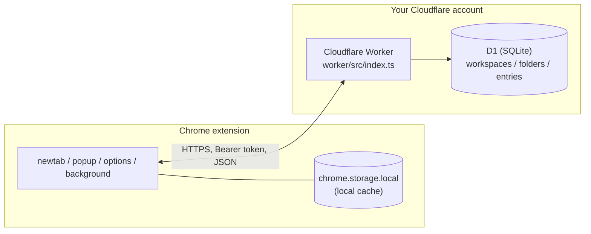

# Architecture

How Shelve is built, for anyone reading the code or thinking about contributing.
For "how do I deploy this," see [README.md](README.md).

## System overview



Each deployment is single-user: one person's own devices, talking to one Worker + one D1 database, authenticated with one shared secret.
There's no accounts system, no multi-tenancy, and no Cloudflare-hosted shared service — every user deploys their own copy.

## Data model

Hierarchy: **workspace → folder → entry**.
Modeled loosely after Toby (its "collections" map to our folders), with two additions Toby doesn't have: an explicit workspace level above folders, and note-only entries.

```sql
CREATE TABLE workspaces (
  id TEXT PRIMARY KEY,
  name TEXT NOT NULL,
  position INTEGER NOT NULL,
  created_at INTEGER NOT NULL,
  updated_at INTEGER NOT NULL,
  deleted_at INTEGER          -- soft-delete marker, see Sync model below
);

CREATE TABLE folders (
  id TEXT PRIMARY KEY,
  workspace_id TEXT NOT NULL REFERENCES workspaces(id),
  name TEXT NOT NULL,
  position INTEGER NOT NULL,
  created_at INTEGER NOT NULL,
  updated_at INTEGER NOT NULL,
  deleted_at INTEGER
);

CREATE TABLE entries (
  id TEXT PRIMARY KEY,
  folder_id TEXT NOT NULL REFERENCES folders(id),
  url TEXT,                  -- NULL for note-only entries
  title TEXT,
  favicon_url TEXT,          -- pointer only, never stored image data
  note TEXT,
  position INTEGER NOT NULL,
  created_at INTEGER NOT NULL,
  updated_at INTEGER NOT NULL,
  deleted_at INTEGER,
  CHECK (url IS NOT NULL OR note IS NOT NULL)
);
```

`position` at every level supports stable drag-and-drop ordering.
The `default` workspace id is fixed (not a random UUID) — every fresh device auto-creates it before ever syncing, and a shared well-known id lets separate devices converge on that one record instead of ending up with two "Home" workspaces after their first sync.

The "open tabs" panel (browse currently-open tabs, drag into a folder) has no schema — it's rendered live from `chrome.tabs.query()` in the extension, not stored anywhere.

**Not yet in the schema:** tags, screenshots, note-editing UI (the `note` column and note-only entries are fully supported end to end, but the UI to create/edit them is currently disabled pending a better interaction design).

## Sync model

### API shape

Reads and writes are asymmetric on purpose:

- `GET /state` returns the whole `{ workspaces, folders, entries }` tree (including soft-deleted rows) — a simple full pull, used for initial load on a new device and for reconciliation.
- Writes are per-resource: `POST`/`PATCH`/`DELETE` on `/workspaces/:id`, `/folders/:id`, `/entries/:id`.
  The extension pushes each local mutation individually and fire-and-forget (the UI never blocks on network) rather than diffing and re-sending whole state trees.

### Conflict resolution

Last-write-wins by `updated_at`, no CRDT merge logic — appropriate for single-user-multi-device (the only real conflict source is the same person editing on two devices while offline, not concurrent strangers).
The Worker's write path is **upsert-by-recency**: a `POST`/`PATCH` only applies if the incoming `updated_at` is newer than what's already stored; a stale/late write from another device just silently loses the race rather than overwriting newer data.

### Deletes are soft, and that's load-bearing

`DELETE /:kind/:id` is a single targeted `UPDATE ... SET deleted_at = ?, updated_at = ? WHERE id = ?` — never a bulk operation, never a full-table replace.
This is the result of two earlier designs that didn't work:

- A **full-snapshot write** (`PUT /state` replacing the entire tree) has a real wipe-the-database failure mode: any client bug that pushes an incomplete or empty payload permanently destroys remote data with no undo.
- **Hard `DELETE` plus a separate tombstone table** fixed the write-safety problem but broke *delete propagation*: the client's merge logic deliberately never removes a local record just because it's absent from a `GET /state` response (same wipe-avoidance principle), so a device pulling after another device's hard-delete would never learn the record was gone — it would keep it forever.

Soft-delete via a `deleted_at` column solves both: still a single targeted write (no wipe risk), and `deleted_at` flows through the exact same "newer `updated_at` wins" merge logic as any other field — a soft-deleted record simply out-recencies a stale non-deleted copy on the next pull, with zero special-cased deletion code.
It also means content is retained rather than erased, which is what makes a future trash view relatively cheap to add.

**Practical implication:** normal use of Shelve can never destroy your data through a sync bug — the worst case is a stale write losing a race, which self-heals on the next sync.
Cloudflare D1's own point-in-time recovery ("Time Travel," see the README FAQ) is the backstop one layer below this, for infrastructure-level issues rather than application logic.

### Client-side merge

`extension/src/lib/sync.ts`'s `mergeArray()` implements the pull side: for each id present in either local or remote, keep whichever has the newer `updated_at`; records present only locally are always kept (never deleted by a pull).
`pushAll()` re-pushes every local record on each app load — idempotent (upsert-by-recency makes re-sending unchanged data a no-op), and it exists specifically to catch anything created locally that never successfully synced (most notably the default workspace on first run, which nothing else explicitly pushes).

## Auth

A single shared secret.
The Worker checks `Authorization: Bearer <token>` against an `API_TOKEN` secret (`wrangler secret put`, stored encrypted by Cloudflare, never written to any file).
No accounts, no OAuth — every request is either "has the token" or 401.

The extension stores the Worker URL and token in `chrome.storage.local` (device-only), deliberately not `chrome.storage.sync` — keeps the token off Google's sync infrastructure, consistent with the project's self-hosted, no-third-party-trust premise.
Trade-off: you enter it once per device rather than it propagating automatically.

## Extension architecture

Manifest V3, four surfaces:

- **`newtab/`** — the main folder-browser UI.
  Two-panel layout (folders in the main area, a live "open tabs" panel on the right, both collapsible).
  Optionally shown on every new tab (see below), always reachable via the toolbar popup's "Open full UI."
- **`popup/`** — the toolbar icon's popup: save the current tab, save every tab in the window (both via a folder picker), or open the full UI.
- **`options/`** — Worker URL + token configuration (with an immediate connectivity check on save), the new-tab toggle, and a "Data" section for Toby import/export and native Shelve backup export/import.
- **`background/`** — a service worker that implements the *optional* new-tab takeover.
  There is deliberately no static `chrome_url_overrides.newtab` in the manifest: Chrome has no supported way to dynamically toggle a manifest-level override, and once declared there's no way back to Chrome's real default new-tab page short of the user disabling the extension entirely.
  Instead, the background worker listens for `chrome.tabs.onCreated` and redirects to `newtab/index.html` only when a device-local preference (default: on) says to — off means Chrome's real default page shows, untouched.

Shared code lives in `extension/src/lib/`: local storage/CRUD (`storage.ts`), sync (`sync.ts`), the in-window modal that replaces native `window.prompt()`/`confirm()` (`modal.ts`, used by both `newtab` and `popup`), Toby import/export (`tobyImport.ts`), manually-added-link metadata fetching (`linkMetadata.ts`), and device-local UI/behavior preferences (`uiState.ts` — folder collapse state, the new-tab toggle; deliberately *not* part of the synced data model, since these are per-device presentation choices, not data).

Native HTML5 drag-and-drop throughout (folders reordering within a workspace, entries moving between folders, tabs dragging in from the open tabs panel) — no drag-and-drop library dependency.

## Tech stack

- **Extension:** Manifest V3, TypeScript + Vite, no UI framework (plain DOM manipulation) — kept deliberately lean.
- **Backend:** Cloudflare Workers + D1 (SQLite), TypeScript, deployed via Wrangler CLI.
- **Shared types:** `Workspace`/`Folder`/`Entry`/`ResourceKind` defined once in `shared/` and imported by both the worker and the extension, so the API contract can't silently drift between client and server.
- **Testing:** Vitest everywhere.
  The Worker's tests run against a real D1 instance via `@cloudflare/vitest-pool-workers`.
  The extension has a Playwright-driven skill (`extension/.claude/skills/run-extension/`) for loading the built, unpacked extension into a real Chromium instance and driving its UI programmatically.

## Repo layout

```
shelve/
  shared/
    types.ts               # Workspace/Folder/Entry/ResourceKind
  worker/
    src/index.ts            # routes, auth, upsert-by-recency, soft-delete
    src/index.test.ts
    schema.sql               # D1 schema (fresh installs)
    migrations/               # ALTER TABLE migrations for already-deployed DBs
    wrangler.toml.example    # committed template — real wrangler.toml is gitignored
  extension/
    manifest.json
    src/background/          # optional new-tab takeover
    src/lib/                 # storage, sync, modal, Toby import, link metadata, ui state
    src/newtab/               # main folder-browser UI
    src/options/               # config + Data (backup/Toby import-export)
    src/popup/                  # toolbar popup
  README.md
  ARCHITECTURE.md             # this file
  LICENSE
```
