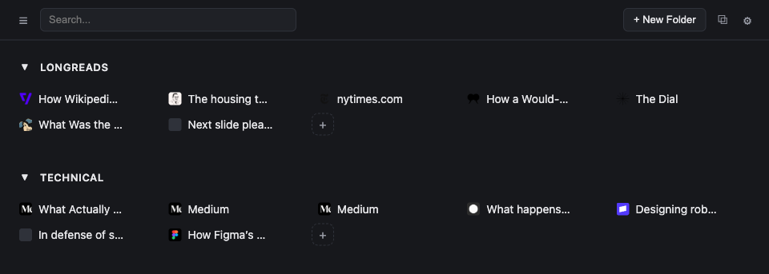

# Shelve

[](https://github.com/daturkel/shelve/actions/workflows/ci.yml)
[](https://github.com/daturkel/shelve/releases)
[](LICENSE)



A self-hosted tab/link organizer, synced across your devices via a Cloudflare Worker + D1 database that **you** deploy and own.
The Worker + D1 backend is the one required piece; on top of it, use a **Chrome extension**, a **responsive web app** (any browser, desktop or mobile), or both — they share the same data and sync through the same Worker.

No accounts system, no arbitrary size limits, and no third party (not even the developer) ever sees your data — it goes only to the Cloudflare account you configure.
(If you've used [Toby](https://www.gettoby.com/), the shape will be familiar — Shelve started as a self-hosted take on it, built after running into Toby's tab-sync size limit.)

## What it does

- **Save tabs into folders** from a full-page folder browser (also your new tab page, optionally) or the toolbar popup — save the current tab, save every tab in the window, or drag a tab in from the live "open tabs" panel. _(Extension only — these need real browser-extension access.)_
  Saving is non-destructive: the original tab stays open.
- **Browse and organize from any browser**, including your phone, via the web app — create/rename/delete/move folders and links, search, trash/restore. Drag-and-drop reordering isn't built for it yet (see [KNOWN_GAPS.md](KNOWN_GAPS.md)).
- **Sync across your devices** through your own Worker + D1 backend.
  Last-write-wins on conflicts; deletes are soft (nothing is destroyed by a sync, ever — see [ARCHITECTURE.md](ARCHITECTURE.md) for why).
- **Organize** with workspaces → folders → entries, drag-and-drop reordering (extension), rename, search, and collapsible folders.
- **Import/export your data** as a JSON backup, or migrate to/from Toby if you're coming from (or trying out) it.

## Status

Functional, pre-1.0.
The core save/sync/organize workflow works end-to-end and is unit- and integration-tested on both the extension and the optional web app; a few nice-to-haves (tags, hard-deleting from trash, drag-and-drop reordering and PWA installability on the web app) are still open — see [KNOWN_GAPS.md](KNOWN_GAPS.md).

## Setup

One required piece — a Cloudflare Worker + D1 database, the sync backend, deployed to _your_ Cloudflare account — plus whichever client(s) you actually want to use on top of it: the Chrome extension, the web app, or both. Neither client depends on the other; pick what fits how you browse.

### Prerequisites

- [Node.js](https://nodejs.org/) 20 or later (an LTS release recommended — this repo was built against Node 24)
- A [Cloudflare account](https://dash.cloudflare.com/sign-up) (the free tier is more than sufficient for personal use)

### 1. Install dependencies

From the repo root:

```bash
npm install
```

### 2. Deploy the backend

```bash
cd worker
npx wrangler login          # opens a browser to authorize Wrangler
npx wrangler d1 create shelve-db    # name it whatever you like
```

Copy `wrangler.toml.example` to `wrangler.toml`, and paste in the `database_id` that `d1 create` just printed.
You can also rename `name` (the Worker) and `database_name` (the D1 database) to anything you want — they're just labels in your own account, nothing else depends on the specific strings `shelve-worker`/`shelve-db`.

```bash
cp wrangler.toml.example wrangler.toml
# edit wrangler.toml: paste in database_id, optionally rename name/database_name

npx wrangler d1 migrations apply shelve-db --remote   # apply the schema

# generate a random token, then paste it when `secret put` prompts:
openssl rand -hex 32
npx wrangler secret put API_TOKEN

npx wrangler deploy
```

`wrangler deploy` prints your Worker's live URL (`https://<your-worker-name>.<your-subdomain>.workers.dev`) — save it, you'll need it in step 3.
Save the `API_TOKEN` value too (e.g. in a password manager) — it's a write-only secret in Cloudflare, there's no way to read it back later.

### 3. Set up a client — pick one or both

Both talk to the same Worker from step 2 and share the same data; neither depends on the other being set up.

#### Option A: Chrome extension

No Chrome Web Store listing yet — load it unpacked.
Either build it yourself:

```bash
cd extension   # from the repo root
npm run build
```

...or skip building entirely: grab the latest `shelve-extension-vX.Y.Z.zip` from [Releases](https://github.com/daturkel/shelve/releases) and unzip it.

Then in Chrome: `chrome://extensions` → enable **Developer mode** (top right) → **Load unpacked** → select `extension/dist` (or the folder you just unzipped).

**Configure sync:** click the Shelve toolbar icon → the gear icon (or right-click the extension icon → **Options**). Enter the Worker URL and API token from step 2, click **Save** — it'll confirm the connection and tell you if it found existing data.

#### Option B: Web app

A responsive folder browser for any browser, desktop or mobile, served as static files from [Cloudflare Pages](https://pages.cloudflare.com/). No environment variables needed at build time — the Worker URL and API token are entered in the deployed app itself (its own gear-icon settings screen, same idea as the extension's options page).

Two ways to deploy it, same build either way (`npm run build --workspace=web`, output in `web/dist`):

**Dashboard, connected to your repo (auto-redeploys on every push):** in the Cloudflare dashboard, create a new Pages project connected to this repo (or your fork), with build command `npm run build --workspace=web` and build output directory `web/dist`.

**Wrangler CLI, one-off or manual redeploys (uses the same Wrangler CLI as step 2):**

```bash
cd web   # from the repo root
npm run build
npx wrangler pages deploy dist --project-name=shelve-web   # name it whatever you like
```

First run prompts you to create the Pages project if it doesn't exist yet; re-run the same command whenever you want to push a new build (e.g. after upgrading — see "Upgrading" below).

Either way, once deployed: open the Pages URL, go to Settings, and enter the same Worker URL/token from step 2.

The web app's data is local-first (stored in the browser's IndexedDB, same architecture as the extension's `chrome.storage.local`) and syncs through your Worker exactly like another device — see [KNOWN_GAPS.md](KNOWN_GAPS.md) for what's different from the extension (no drag-and-drop reordering yet, no offline/installable PWA support yet).

### Upgrading

The Worker and each client are versioned together but deployed independently — you update each by hand, on your own schedule, so they can never be assumed to be in lock-step. Update the Worker first, then whichever client(s) you have set up:

```bash
cd worker   # from the repo root
npx wrangler d1 migrations apply shelve-db --remote   # applies any new migrations; a no-op if there aren't any
npx wrangler deploy
```

`wrangler d1 migrations apply` only runs migrations it hasn't already recorded as applied, so it's safe to run on every upgrade whether or not that particular update actually changed the schema.
If you ever do update a client before the Worker, it'll show a clear warning ("Worker: vX.Y.Z — its schema is out of date") and sync pauses itself rather than risk losing data against a schema the Worker doesn't have yet — running the command above clears it.

**Extension:**

```bash
cd extension   # from the repo root
npm run build
```

(Or download the new version's zip from [Releases](https://github.com/daturkel/shelve/releases) instead of building it yourself — same as initial setup.)
Then reload the extension from `chrome://extensions` (the circular reload icon on Shelve's card, or **Remove** + **Load unpacked** again if you switched to a freshly-unzipped folder) — unpacked extensions don't auto-reload on file or folder changes, and there's no Chrome Web Store listing yet to update it for you automatically.

**Web app:** if it's connected to your repo via the Cloudflare Pages dashboard, pushing/pulling a new version redeploys it automatically. If you used the Wrangler CLI instead, just re-run the same deploy command from step 3:

```bash
cd web   # from the repo root
npm run build
npx wrangler pages deploy dist --project-name=shelve-web
```

It also needs a Worker that includes CORS support, added in the same release as the web app itself — a normal `npx wrangler deploy` upgrade already covers this as long as you've redeployed since then. A Worker predating that will reject every request from the web app with an opaque network error rather than a readable one, since it never sends the headers a browser requires for a cross-origin request in the first place.

## FAQ

**What is Wrangler?**
Cloudflare's official CLI for developing and deploying Workers, D1 databases, Pages, and the rest of the Cloudflare developer platform.
Every `npx wrangler ...` command in Setup uses it — `npx` runs the version pinned in `worker/package.json` on the fly (npm workspaces hoist it repo-wide, so this works the same from `web/` as it does from `worker/`), so you never install anything globally just to deploy Shelve.

**Should I install Node.js globally or per-user?**
Either works, but a per-user install is generally the better default if you do any other JS/TS development: a [version manager](https://github.com/nvm-sh/nvm) (nvm, fnm, volta, etc.) installs Node under your home directory, needs no `sudo`, and lets you switch Node versions per project.
A global/system install (the official installer, or a package manager like Homebrew) is simpler for a single-purpose machine, but can require elevated permissions for global npm installs and only lets you have one Node version at a time.
This repo doesn't care which you use, only that `node`/`npm` end up on your `PATH`.

**Is my data private?**
Yes — it lives only in the D1 database in your own Cloudflare account.
Nothing is sent anywhere else, and the developer has no access to it.

**What does this cost?**
Cloudflare's free tier (100k Worker requests/day, 5GB D1 storage) comfortably covers personal use.
Realistically, $0/month.

**How do multiple devices work?**
Configure each device's client — extension, web app, or both — with the same Worker URL and API token (step 3 above).
They'll sync through your one Worker + D1 deployment, regardless of which client(s) each device uses.

**Can I use Shelve from my phone or a non-Chrome browser?**
Yes, via the web app (step 3, option B) — deploy it once to Cloudflare Pages and it works from any modern browser, desktop or mobile.
It shares the same Worker and data as the extension; the extension itself stays Chrome-only (browser extensions aren't cross-platform).

**Can I migrate from Toby?**
Yes — in either client's settings screen (the extension's options page, or the web app's gear icon), go to Data → **Import from Toby**, pointed at Toby's own JSON export (Toby: Settings → Data → Export → JSON).
You can also export back to Toby's format, or export/import a native Shelve backup for device migration or safekeeping.

**What if my Worker/D1 gets into a bad state, or I need an emergency restore?**
Cloudflare D1 has built-in point-in-time recovery ("Time Travel") with no setup required — you can restore your database to any minute within the last 7 days (Workers Free) or 30 days (Workers Paid):

```bash
npx wrangler d1 time-travel info shelve-db
npx wrangler d1 time-travel restore shelve-db --timestamp="2026-07-01T12:00:00Z"
```

Note this restores the whole database in place — it's a genuine emergency-recovery tool, not a routine undo button.
Day-to-day, Shelve's own sync design already avoids destructive operations: deletes are soft (nothing is ever hard-deleted by normal use) and syncing can only ever add or update data, never wipe it — see [ARCHITECTURE.md](ARCHITECTURE.md#sync-model) for why.

**What if I lose my API token?**
Generate a new one and re-run `wrangler secret put API_TOKEN` on the Worker, then update it in each device's client (the extension's options page, or the web app's settings screen).
Your data in D1 is untouched — the token only gates access to it.

**How do I revoke API access (e.g. a lost or compromised device)?**
There's only one shared `API_TOKEN` per deployment, not one per device, so revoking access means rotating that single secret — which immediately invalidates it everywhere, including your other devices:

```bash
openssl rand -hex 32
npx wrangler secret put API_TOKEN
```

Update the new token on every device you want to keep syncing.
Any device you don't update (the lost/compromised one) starts getting 401s and can no longer read or write your data.
There's no way to revoke just one device's access while leaving others on the old token — a real limitation of the single-shared-secret design, acceptable given the intended use case (your own personal devices, not a team).

**Can other people see or use my deployment?**
Only if they have your Worker URL _and_ your API token.
There's no accounts system — it's designed for one person's own devices.

## How it's built

See [ARCHITECTURE.md](ARCHITECTURE.md) for the data model, sync design, and repo layout.

## Changelog

See [CHANGELOG.md](CHANGELOG.md).
For things that are missing or incomplete, see [KNOWN_GAPS.md](KNOWN_GAPS.md).
For cutting a release or updating the README's screenshot, see [RELEASING.md](RELEASING.md).

## License

MIT — see [LICENSE](LICENSE).
