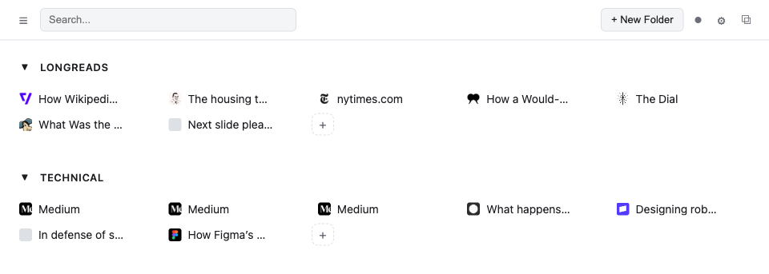

# Shelve

[](https://github.com/daturkel/shelve/actions/workflows/ci.yml)
[](https://github.com/daturkel/shelve/releases)
[](LICENSE)



A self-hosted tab/link organizer, synced across your devices via a Cloudflare Worker + D1 database that **you** deploy and own.
The Worker + D1 backend is the one required piece; on top of it, use a **Chrome extension**, a **responsive web app** (any browser, desktop or mobile), or both — they share the same data and sync through the same Worker.

No accounts system, no arbitrary size limits, and no third party (not even the developer) ever sees your data — it goes only to the Cloudflare account you configure.
(If you've used [Toby](https://www.gettoby.com/), the shape will be familiar — Shelve started as a self-hosted take on it, built after running into Toby's tab-sync size limit.)

## What it does

- **Save tabs into folders** from a full-page folder browser (also your new tab page, optionally) or the toolbar popup — save the current tab, save every tab in the window, or drag a tab in from the live "open tabs" panel. _(Extension only — these need real browser-extension access.)_
  Saving is non-destructive: the original tab stays open.
- **Browse and organize from any browser**, including your phone, via the web app — create/rename/delete/move folders and links, search, trash/restore, drag-and-drop reordering on desktop (same underlying interaction as the extension; not usable via touch yet — see [KNOWN_GAPS.md](KNOWN_GAPS.md)).
- **Sync across your devices** through your own Worker + D1 backend.
  Last-write-wins on conflicts; deletes are soft (nothing is destroyed by a sync, ever — see [ARCHITECTURE.md](ARCHITECTURE.md) for why).
- **Organize** with workspaces → folders → entries — create, rename, delete (cascading, restorable from trash), and reorder at every level via drag-and-drop — plus search and collapsible folders.
- **Import/export your data** as a JSON backup, or migrate to/from Toby if you're coming from (or trying out) it.

## Status

Functional, pre-1.0.
The core save/sync/organize workflow works end-to-end and is unit- and integration-tested on both the extension and the optional web app; a few nice-to-haves (tags, touch-friendly drag-and-drop and PWA installability on the web app) are still open — see [KNOWN_GAPS.md](KNOWN_GAPS.md).

## Quickstart

Prerequisites: [Node.js](https://nodejs.org/) 20+ and a [Cloudflare account](https://dash.cloudflare.com/sign-up) — Cloudflare's free tier (100k Worker requests/day, 5GB D1 storage) comfortably covers personal use, realistically $0/month.

```bash
git clone https://github.com/daturkel/shelve.git
cd shelve
git checkout vX.Y.Z   # replace with the latest tag from https://github.com/daturkel/shelve/releases — main may be unstable
npm install
npm run setup
```

`npm run setup` is an interactive wizard that deploys the Worker + D1 backend and, optionally, the web app — it prints every command before running it and asks for confirmation first, and it's safe to re-run if you stop partway through. Chrome extension setup is a manual browser step (`chrome://extensions` → Load unpacked) that the wizard prints instructions for at the end.

For the full walkthrough (each step explained, or doing it by hand instead of via the wizard), see [SETUP.md](SETUP.md). For upgrading an existing install, lost tokens, revoking a device, or restoring from a backup, see [OPERATIONS.md](OPERATIONS.md).

## Learn more

- [SETUP.md](SETUP.md) — deploying and upgrading, wizard or by hand
- [OPERATIONS.md](OPERATIONS.md) — day-two questions: multiple devices, Toby migration, lost tokens, revoking access, emergency restore
- [ARCHITECTURE.md](ARCHITECTURE.md) — data model, sync design, repo layout
- [KNOWN_GAPS.md](KNOWN_GAPS.md) — what's missing or incomplete right now
- [CHANGELOG.md](CHANGELOG.md) — what changed, release by release
- [RELEASING.md](RELEASING.md) — cutting a release (maintainer-facing)

## License

MIT — see [LICENSE](LICENSE).
