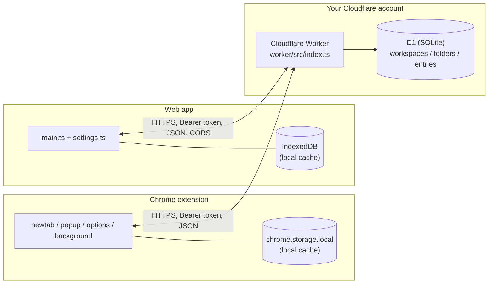

# Architecture

How Shelve is built, for anyone reading the code or thinking about contributing. For "how do I deploy this," see [SETUP.md](SETUP.md).

## System overview



Each deployment is single-user: one person's own devices, one Worker, one D1 database, one shared secret. There's no accounts system and no Cloudflare-hosted shared service — every user deploys their own copy.

## Data model

Hierarchy: **workspace → folder → entry**. Modeled loosely after Toby (its "collections" map to our folders, "spaces" to our workspaces), with one addition Toby doesn't have: note-only entries.

```sql
CREATE TABLE workspaces (
  id TEXT PRIMARY KEY,
  name TEXT NOT NULL,
  position INTEGER NOT NULL,
  created_at INTEGER NOT NULL,
  updated_at INTEGER NOT NULL,
  deleted_at INTEGER          -- soft-delete marker, see Sync below
);

CREATE TABLE folders (
  id TEXT PRIMARY KEY,
  workspace_id TEXT NOT NULL REFERENCES workspaces(id) ON DELETE CASCADE,
  name TEXT NOT NULL,
  position INTEGER NOT NULL,
  created_at INTEGER NOT NULL,
  updated_at INTEGER NOT NULL,
  deleted_at INTEGER
);

CREATE TABLE entries (
  id TEXT PRIMARY KEY,
  folder_id TEXT NOT NULL REFERENCES folders(id) ON DELETE CASCADE,
  url TEXT,                  -- NULL for note-only entries
  title TEXT,
  favicon_url TEXT,          -- pointer only, never stored image data
  note TEXT,
  position INTEGER NOT NULL,
  created_at INTEGER NOT NULL,
  updated_at INTEGER NOT NULL,
  deleted_at INTEGER,
  CHECK (url IS NOT NULL OR note IS NOT NULL)
);
```

`position` at every level supports drag-and-drop ordering. The `default` workspace uses a fixed id (not a random UUID) so every fresh device converges on the same "Home" workspace instead of creating duplicates on first sync — see [KNOWN_GAPS.md](KNOWN_GAPS.md) for the one edge case this causes.

The "open tabs" panel (extension only) has no schema — it's rendered live from `chrome.tabs.query()`, never stored.

Not yet in the schema: tags, screenshots. Note-only entries are fully supported end to end but have no editing UI yet.

## Sync model

- `GET /state` returns the whole `{ workspaces, folders, entries }` tree, including soft-deleted rows — used for initial load and reconciliation.
- Writes are per-resource: `POST`/`PATCH`/`DELETE` on `/workspaces/:id`, `/folders/:id`, `/entries/:id`. Each client pushes mutations individually and fire-and-forget; the UI never blocks on network.
- Conflicts resolve by last-write-wins on `updated_at`: a write only applies if it's newer than what's stored, so a stale write from another device just loses the race silently. No CRDT merge — appropriate for one person's own devices, not concurrent strangers.
- Deletes are soft (`deleted_at`, set via a single targeted `UPDATE`) rather than a real `DELETE`. That means the same "newer `updated_at` wins" merge logic handles deletes with no special-casing, and a sync can never destroy data — worst case is a stale write losing a race, which self-heals on the next sync. Cloudflare D1's own point-in-time recovery ("Time Travel," see [OPERATIONS.md](OPERATIONS.md)) is the backstop below that, for infrastructure issues rather than app logic.
- **Permanent delete** is the deliberate exception: `DELETE /:kind/:id?permanent=true` (trash view only) does a real `DELETE`, and only against an already-soft-deleted record — the Worker rejects it otherwise. Cascading deletes (`ON DELETE CASCADE` on `folders`/`entries`) mean permanently deleting a workspace or folder removes everything under it in one statement.
- `GET /health` reports `{ ok, version, schemaVersion }`. Each client checks this once per page load and refuses to sync (with a visible warning, not just a console log) if the Worker's schema is behind what it expects. A merely-unreachable Worker is treated differently — sync fails open, consistent with the rest of sync's best-effort error handling.
- `core/lib/sync.ts`'s `mergeArray()` implements the pull side (keep whichever side has the newer `updated_at`; local-only records are always kept). `pushAll()` re-pushes every local record on each load — idempotent, and it's what gets a device's freshly-created default workspace onto the Worker the first time.

## Other Worker routes

`GET /link-metadata?url=<url>` (`worker/src/linkMetadata.ts`) fetches a URL server-side and extracts a title/favicon via `HTMLRewriter`, for the web app's "Add link" flow — a plain web page can't do this fetch itself due to CORS, but the extension can. Same Bearer auth as everything else.

## Auth

A single shared secret. The Worker checks `Authorization: Bearer <token>` against an `API_TOKEN` secret (`wrangler secret put`, encrypted by Cloudflare, never written to a file). No accounts, no OAuth — a request either has the token or gets a 401.

Each client stores the Worker URL and token locally (`chrome.storage.local` for the extension, IndexedDB for the web app) rather than in any synced storage, keeping the token off third-party sync infrastructure. Trade-off: you enter it once per device.

The web app runs cross-origin from the Worker, so the Worker sends permissive CORS headers (`Access-Control-Allow-Origin: *`) — the bearer token is the actual security boundary either way, not same-origin policy.

## Code layout

- **`shared/`** — `Workspace`/`Folder`/`Entry`/`LinkMetadata` types, imported by the worker, `core`, the extension, and the web app so the API contract can't drift.
- **`worker/`** — the Cloudflare Worker: routing, auth, sync logic, D1 migrations.
- **`core/`** — platform-agnostic logic and UI shared by the extension and web app: storage/sync, the folder-browser DOM builders, Toby import/export, device-local UI state. Two small interfaces (`Store` for persistence, `TabActions` for opening/closing tabs) are the only seam where platform-specific code plugs in — `core/tsconfig.json` has no Chrome types, so any accidental `chrome.*` call in `core/` fails the build.
- **`extension/`** — Manifest V3, four surfaces: `newtab/` (main folder browser + live open-tabs panel), `popup/` (save current tab / save window), `options/` (Worker config, Toby import/export, backup), `background/` (optional new-tab takeover, since Chrome has no supported way to toggle a manifest-level override at runtime). `extension/src/lib/` holds just the two adapters (`chromeStore.ts`, `chromeTabActions.ts`) that implement `core`'s `Store`/`TabActions` via real `chrome.*` APIs.
- **`web/`** — a single-page Vite app reusing `core/`, with its own `Store` (IndexedDB, plus a `BroadcastChannel` so multiple open tabs stay in sync with each other), `TabActions` (`window.open`; closing tabs is a no-op — a web page can't close an arbitrary tab), and a settings screen in place of the extension's options page. Deployed separately and optionally, as a static build to Cloudflare Pages.

## Tech stack

- **Extension & web app:** TypeScript + Vite, no UI framework (plain DOM manipulation).
- **Backend:** Cloudflare Workers + D1 (SQLite), deployed via Wrangler.
- **Testing:** Vitest for unit/integration tests (the Worker's run against a real D1 instance via `@cloudflare/vitest-pool-workers`); Playwright for a small e2e smoke suite in each of `extension/` and `web/`.

## Repo layout

```
shelve/
  shared/
    types.ts
  worker/
    src/index.ts             # routes, auth, upsert-by-recency, soft-delete
    src/linkMetadata.ts       # GET /link-metadata
    migrations/               # numbered D1 schema migrations
    wrangler.toml.example
  core/
    lib/                      # storage, sync, modal, Toby import, link metadata, ui state, Store
    ui/                       # folder-browser DOM builders
  extension/
    manifest.json
    src/background/           # optional new-tab takeover
    src/lib/                  # chromeStore.ts / chromeTabActions.ts
    src/newtab/                # main.ts + tabsPanel.ts (chrome.tabs-only)
    src/options/                # config + Data (backup/Toby import-export)
    src/popup/                   # toolbar popup
    e2e/                         # Playwright smoke suite
  web/
    src/main.ts                 # wiring
    src/webStore.ts              # Store via IndexedDB + BroadcastChannel
    src/webTabActions.ts         # TabActions via window.open
    src/webLinkMetadata.ts       # fetchLinkMetadata via the Worker's /link-metadata proxy
    src/settings.ts              # settings/connect screen
    public/_headers              # Cloudflare Pages CSP
    e2e/                         # Playwright smoke suite
  scripts/
    wizard/                      # npm run wizard:deploy / npm run wizard:status
    bump-version.mjs
    release.mjs
  docs/
    SETUP.md
    OPERATIONS.md
    ARCHITECTURE.md              # this file
    KNOWN_GAPS.md
    RELEASING.md
  README.md
  CHANGELOG.md
  LICENSE
```
